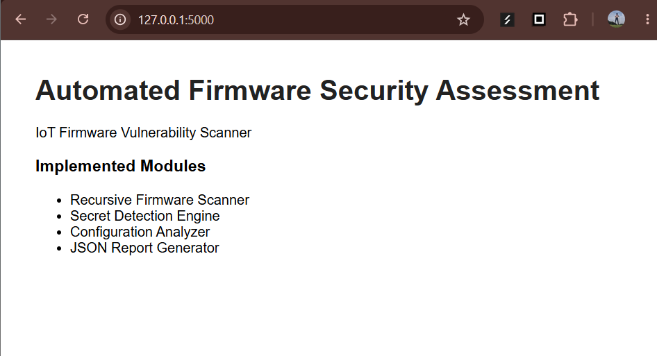
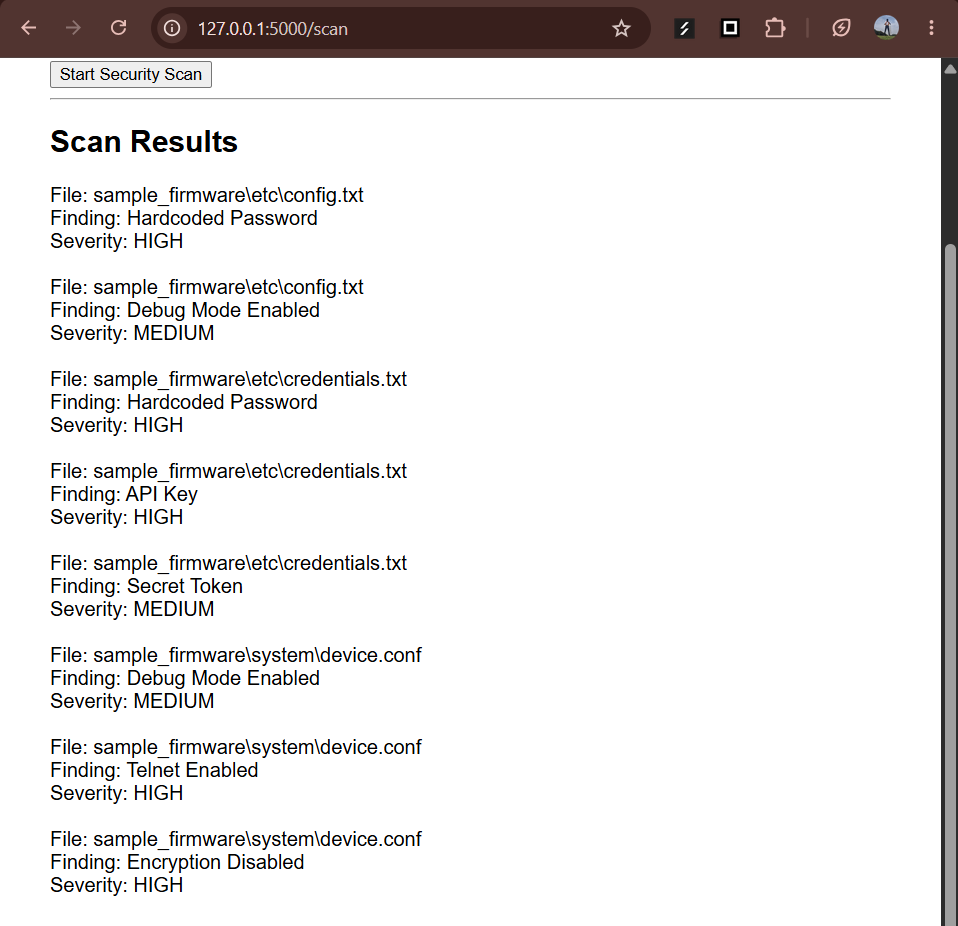
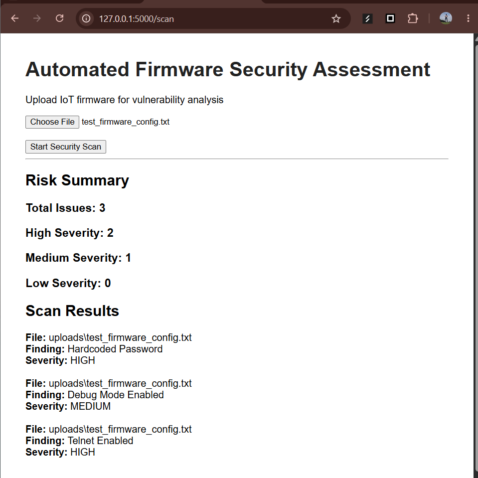
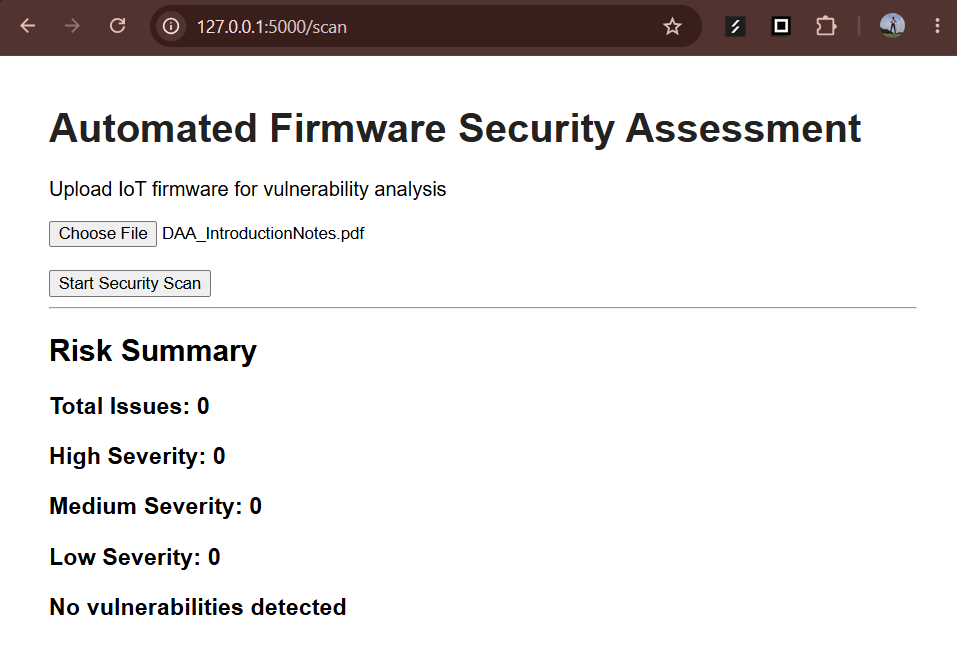
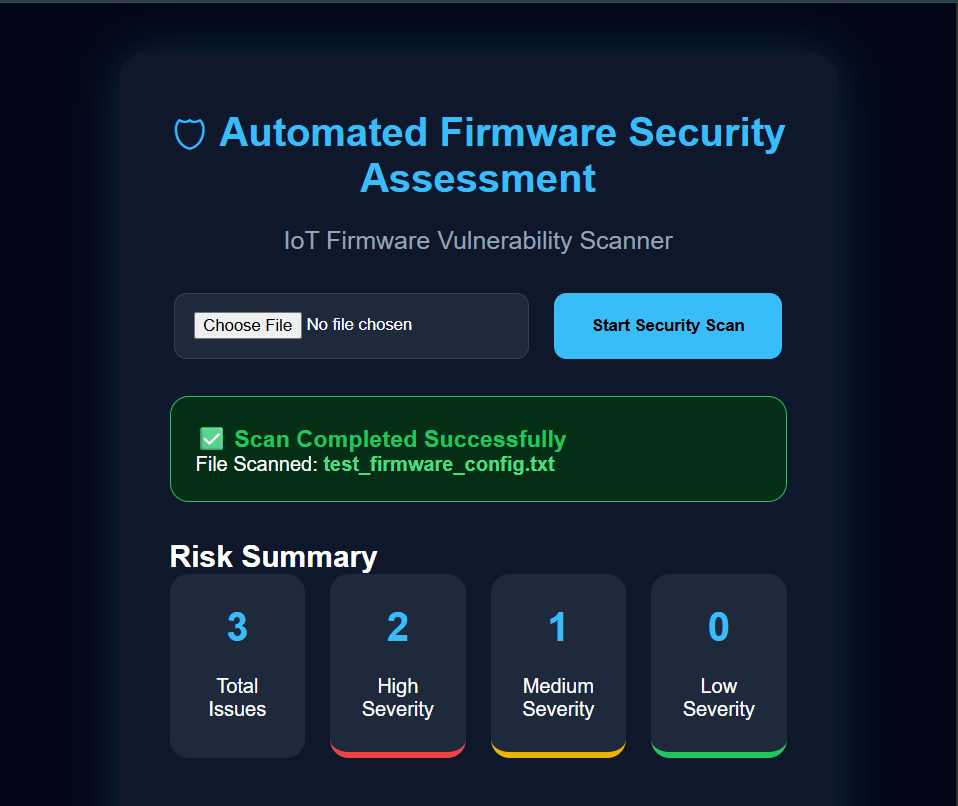
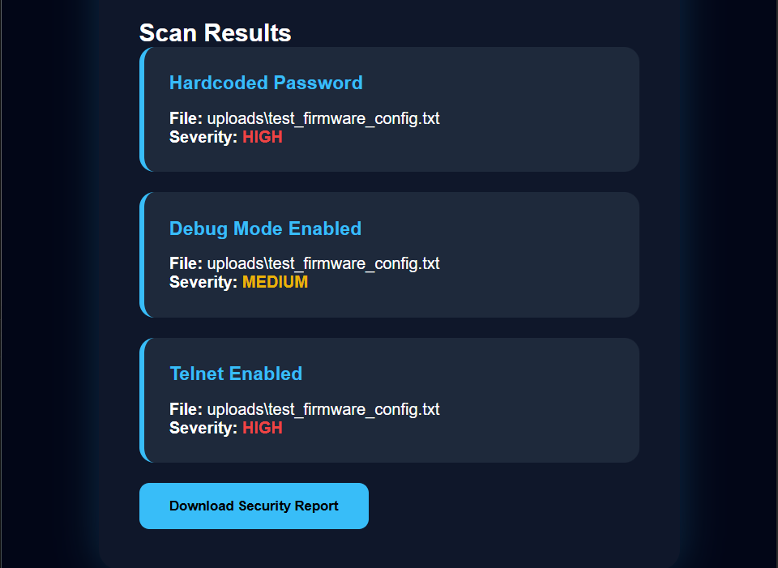

# Automated Firmware Security Assessment and Vulnerability Reporting for IoT Devices

## Overview

Automated IoT firmware analysis platform for detecting insecure configurations, exposed secrets, and security risks.

The system allows users to upload firmware files through a Flask dashboard, performs security analysis, detects risky configurations and exposed secrets, and generates vulnerability findings.

## Features

- Firmware upload through web interface
- Automated file analysis
- Hardcoded credential detection
- API key and secret token detection
- Insecure configuration detection
- Severity classification
- Risk summary dashboard
- Vulnerability report generation

## Technology Stack

- Python
- Flask
- HTML
- CSS
- SQLite Database
- Binwalk Firmware Extraction
- Git and GitHub

## Architecture

Detailed architecture documentation:

See:

docs/architecture.md

## Modules

### Scanner Engine

Handles firmware files and performs recursive analysis.

### Secret Detector

Detects sensitive information such as:

- Password exposure
- API keys
- Secret tokens

### Configuration Analyzer

Detects insecure configurations:

- Debug mode enabled
- Telnet enabled
- Encryption disabled

### Risk Analyzer

Calculates:

- Total vulnerabilities
- High severity issues
- Medium severity issues
- Low severity issues

## Screenshots

## Screenshots

### Flask Upload Interface

### Scanner Integration

### Dynamic Firmware Scan

### Risk Analysis Dashboard

### Final Security Dashboard UI

### Vulnerability Scan Results

## Current Status

Completed:

- Firmware upload dashboard
- Recursive scanner engine
- Secret detection module
- Configuration security analysis
- Risk classification system
- SQLite vulnerability storage
- JSON vulnerability reports
- Binwalk firmware extraction support

Upcoming:

- PDF report generation
- UI improvements
- Final testing
- Internship documentation

## Author

Smruthi Nayak
