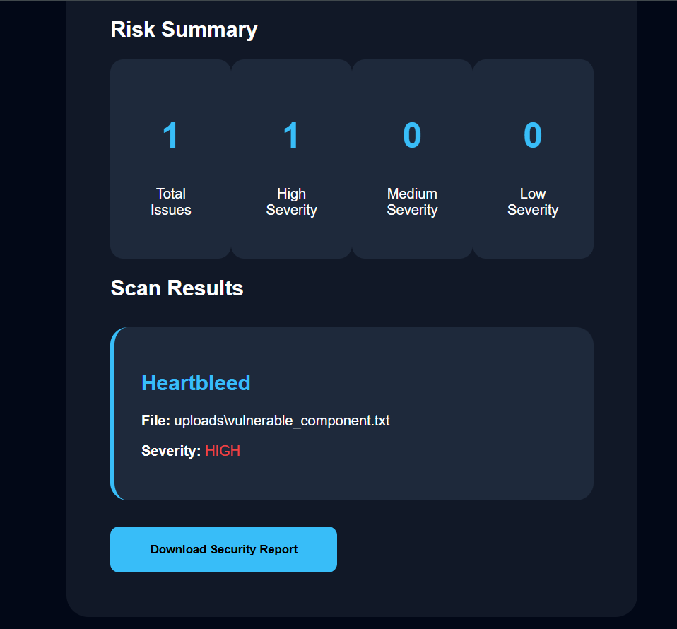
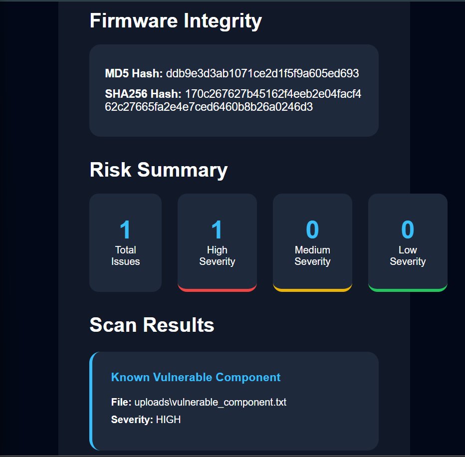
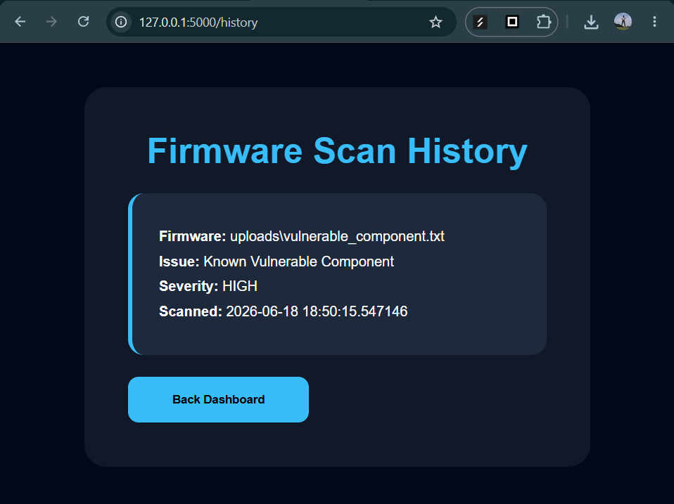
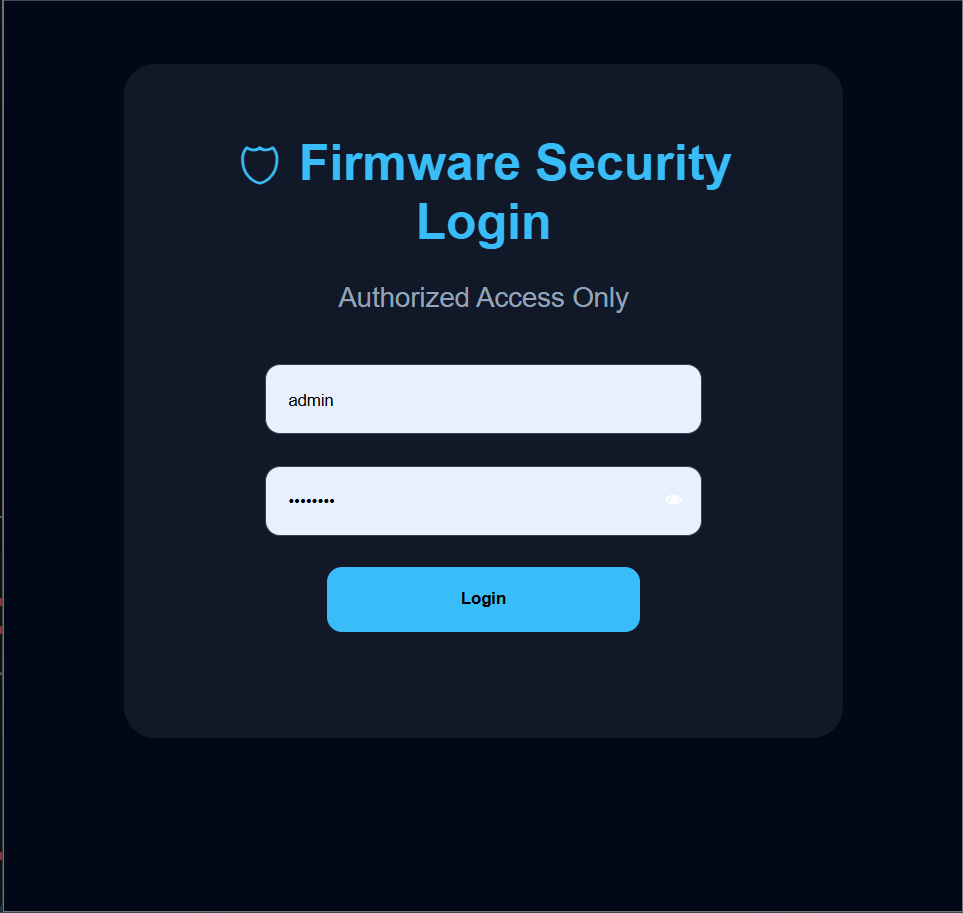

# Automated Firmware Security Assessment and Vulnerability Reporting for IoT Devices

## Overview

Automated IoT firmware analysis platform for detecting insecure configurations, exposed secrets, and security risks.

The system allows users to upload firmware files through a Flask dashboard, performs security analysis, detects risky configurations and exposed secrets, and generates vulnerability findings.

## Features

- Firmware upload through web interface
- Automated file analysis
- Hardcoded credential detection
- API key and secret token detection
- Insecure configuration detection
- Severity classification
- Risk summary dashboard
- Vulnerability report generation
- Known vulnerability detection using CVE matching
- Firmware integrity verification using MD5 and SHA256 hashing
- Firmware risk scoring engine
- Numerical vulnerability prioritization
- SOC style security dashboard
- Risk visualization meter

## Technology Stack

- Python
- Flask
- HTML
- CSS
- SQLite Database
- Binwalk Firmware Extraction
- Git and GitHub

## Architecture

Detailed architecture documentation:

See:

docs/architecture.md

## Modules

### Scanner Engine

Handles firmware files and performs recursive analysis.

### Secret Detector

Detects sensitive information such as:

- Password exposure
- API keys
- Secret tokens

### Configuration Analyzer

Detects insecure configurations:

- Debug mode enabled
- Telnet enabled
- Encryption disabled

### Risk Analyzer

Calculates:

- Total vulnerabilities
- High severity issues
- Medium severity issues
- Low severity issues

### CVE Checker

Detects vulnerable firmware components by comparing discovered software versions with a vulnerability database.

Detects:

- Vulnerable packages
- CVE identifiers
- Severity level

### Hash Analyzer

Calculates firmware fingerprints for integrity verification.

Generates:

- MD5 hash
- SHA256 hash

### Risk Scoring Engine

Calculates firmware security exposure using severity based scoring.

Severity weights:

- High vulnerabilities
- Medium vulnerabilities
- Low vulnerabilities

Generates:

- Firmware risk score
- Risk level classification
- Remediation priority

## Screenshots

### Flask Upload Interface

### Scanner Integration

### Dynamic Firmware Scan

### Risk Analysis Dashboard

### Final Security Dashboard UI

### Vulnerability Scan Results

### CVE Detection

### Firmware Hash Integrity Analysis

### Firmware Scan History

### Admin Authentication

## Current Status

Completed:

Completed:

- Core scanner
- Security modules
- Flask integration
- Upload workflow
- Risk dashboard
- Firmware metadata extraction
- Hash based integrity verification
- Scan history storage
- Authentication system
- Firmware risk scoring engine
- SOC style dashboard UI

Upcoming:

- User authentication and access control
- Dashboard security improvements
- Advanced vulnerability checks
- Deployment preparation

## Author

Smruthi Nayak
