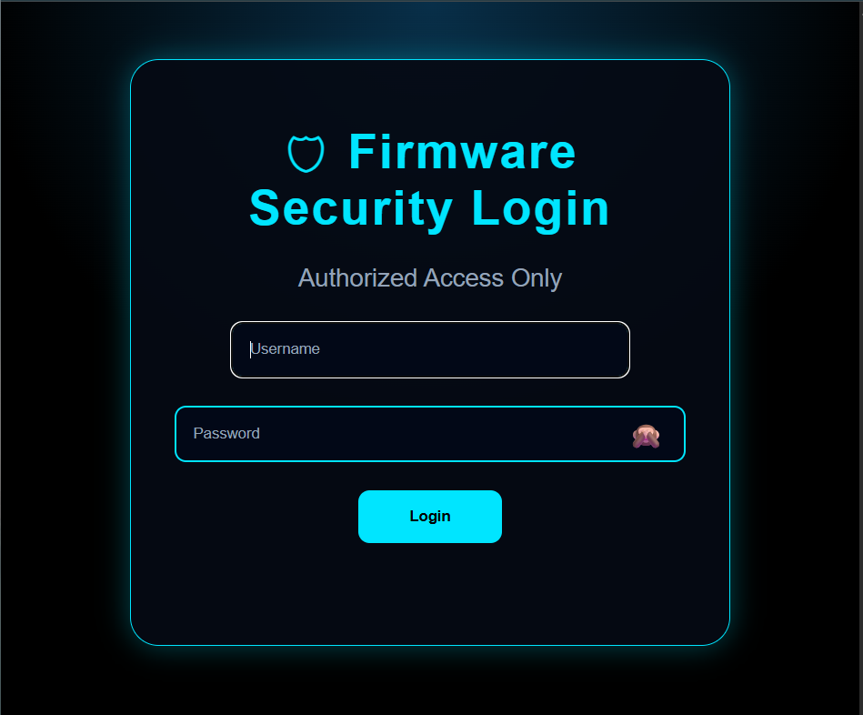
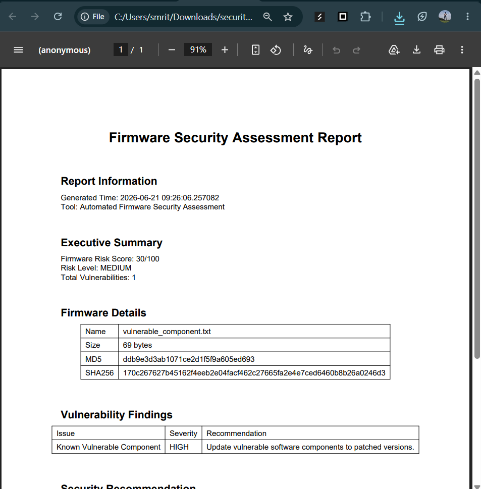
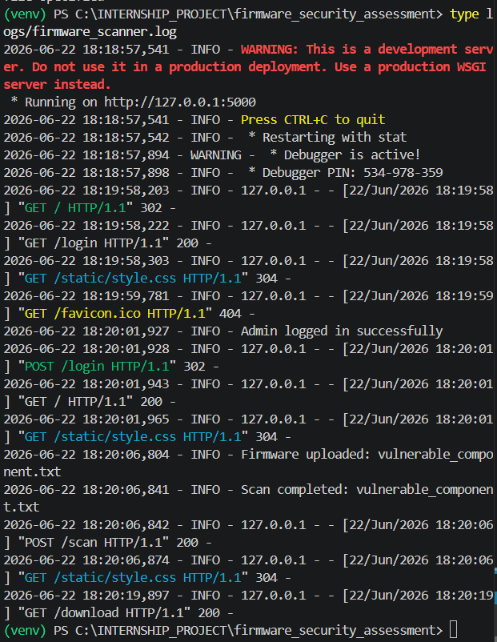

# Automated Firmware Security Assessment and Vulnerability Reporting for IoT Devices

## Overview

Automated Firmware Security Assessment is an IoT security analysis platform designed to analyze firmware files, detect vulnerabilities, calculate risk exposure, and generate professional security reports.

The system provides a Flask based dashboard where firmware files can be uploaded and analyzed through multiple security modules.

It helps identify:

- Exposed secrets
- Hardcoded credentials
- Insecure configurations
- Known vulnerable components
- Firmware integrity changes
- Overall firmware risk level

## Features

- Firmware upload through secure web dashboard
- Automated firmware analysis
- Recursive file scanning
- Binwalk based firmware extraction support

- Hardcoded credential detection
- API key and secret detection
- Insecure configuration detection
- CVE based vulnerable component identification

- Firmware metadata extraction
- MD5 and SHA256 integrity verification

- Severity based vulnerability classification
- Firmware risk scoring engine
- Risk visualization dashboard

- Security remediation recommendations
- Patch and mitigation guidance

- SQLite scan history storage
- Previous firmware scan tracking

- Secure admin authentication
- Password hash based verification
- Session protected dashboard access

- Professional PDF security audit reports
- JSON security report generation

- Secure file upload handling
- Application activity logging
- Error handling and fault tolerance

## Technology Stack

- Python
- Flask
- HTML
- CSS
- SQLite Database
- ReportLab PDF Generator
- Werkzeug Security
- Binwalk Firmware Extraction
- Git and GitHub

## Architecture

Detailed architecture documentation:

`docs/architecture.md`

## Modules

## Scanner Engine

Performs firmware analysis and coordinates security scanning.

Responsibilities:

- File traversal
- Security module execution
- Vulnerability collection

## Firmware Extractor

Extracts firmware contents for analysis.

Supports:

- Binwalk extraction
- Fallback scanning if extraction fails

## Secret Detector

Detects sensitive information exposure.

Finds:

- Password leaks
- API keys
- Secret tokens

## Configuration Analyzer

Detects insecure firmware configurations.

Examples:

- Debug mode enabled
- Telnet enabled
- Weak security settings

## CVE Checker

Identifies known vulnerable components.

Detects:

- Software versions
- CVE identifiers
- Vulnerability severity

## Firmware Analyzer

Extracts firmware metadata.

Provides:

- File name
- File size
- Scan information

## Hash Analyzer

Performs firmware integrity verification.

Generates:

- MD5 hash
- SHA256 hash

## Risk Analyzer

Generates vulnerability statistics.

Tracks:

- High severity findings
- Medium severity findings
- Low severity findings

## Risk Scoring Engine

Calculates numerical firmware security risk.

Provides:

- Risk score
- Risk level
- Remediation priority

## Remediation Engine

Provides security recommendations.

Examples:

- Remove hardcoded credentials
- Disable insecure services
- Update vulnerable components

## Database Module

Stores firmware scan history.

Implemented using SQLite.

Stores:

- Firmware findings
- Vulnerability history
- Previous scans

## Authentication Module

Protects access to the dashboard.

Features:

- Admin login
- Secure password hash verification
- Session based authentication

## Report Generator

Generates machine readable security reports.

Output:

- JSON security report

## PDF Report Generator

Generates professional audit reports.

Includes:

- Executive summary
- Firmware details
- Risk score
- Integrity hashes
- Vulnerability findings
- Remediation steps

## Logging and Hardening

Improves reliability and monitoring.

Includes:

- Secure filename handling
- Error handling
- Activity logging

# Screenshots

## Firmware Upload Interface

## Scanner Integration

## Dynamic Firmware Scan

## Risk Dashboard

## Security Dashboard UI

## Scan Results

## CVE Detection

## Firmware Hash Integrity

## Scan History

## Secure Login

## PDF Audit Report

## Logging System

# Current Status

Completed:

- Firmware security scanner
- Vulnerability detection modules
- CVE detection
- Integrity verification
- Risk analysis engine
- Risk scoring system
- Remediation engine
- Flask security dashboard
- Authentication system
- Scan history database
- PDF audit reporting
- Error handling
- Logging system

Remaining Improvements:

- Testing and validation
- Documentation refinement
- Final release preparation

## Project Purpose

This project demonstrates an end-to-end IoT firmware security assessment workflow:

Firmware Upload

↓

Security Analysis

↓

Risk Calculation

↓

Remediation Recommendation

↓

Security Reporting

## Author
Smruthi Nayak